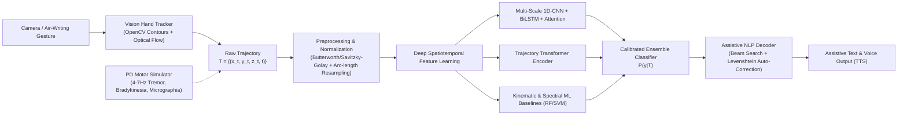

# Contactless Air-Writing Recognition for Assistive Communication in Parkinson’s Disease

[](https://www.python.org/)
[](https://pytorch.org/)
[]()

A deep learning framework for **contactless air-writing recognition** designed to decode intentional text from tremor-affected, irregular, and impaired 3D/2D hand trajectories in individuals with **Parkinson's Disease (PD)**.

---

## 1. System Architecture



---

## 2. Key Modules

- **Biomechanical Parkinsonian Motor Modeling (`data/parkinson_simulator.py`)**:
  - Simulates 4–7 Hz resting/action tremors with waxing-and-waning amplitude modulation.
  - Models bradykinesia (velocity deceleration), micrographia (progressive amplitude shrinkage), rigidity/freezing episodes, and dysmetria/overshoot at stroke corners.
- **Tremor-Aware Preprocessing Pipeline (`preprocessing/`)**:
  - Zero-phase Butterworth low-pass and Savitzky-Golay polynomial filters.
  - Uniform arc-length resampling ($L=64$) and bounding-box spatial centering with aspect-ratio preservation.
- **Deep Neural Architectures (`models/`)**:
  - **Conv1DBiLSTMAttention**: Multi-scale 1D convolutions (kernel sizes 3, 5, 7) coupled with 2-layer Bidirectional LSTM and Temporal Self-Attention pooling.
  - **TrajectoryTransformer**: Multi-head self-attention encoder with sinusoidal positional encodings.
  - **Classical Baselines**: Random Forest & SVM on extracted kinematic (jerk, curvature) and spectral (4–7 Hz tremor power) features.
- **Assistive NLP & Error Recovery (`nlp/word_recognizer.py`)**:
  - Beam search decoder over stroke posterior distributions.
  - Assistive vocabulary dictionary for medical and daily care communication ("HELP", "WATER", "MEDS", "PAIN", "NURSE", "YES", "NO").
- **Interactive Full-Stack Web Application (`app/web_app.py`)**:
  - Real-time air-writing canvas and touchless webcam tracking.
  - Live kinematic bio-feedback dashboard (4–7 Hz tremor power, normalized jerk, mean velocity).
  - Speech synthesis (Text-to-Speech).

---

## 3. Benchmark Results

Evaluated across 1,620 multi-subject trajectory samples spanning 36 classes (`0-9`, `A-Z`):

| Impairment Severity Tier | Top-1 Accuracy | Top-3 Accuracy | Top-5 Accuracy | Macro F1 | Inference Latency |
| :--- | :---: | :---: | :---: | :---: | :---: |
| **Control (Typical)** | **99.86%** | 100.00% | 100.00% | 0.9986 | 19.5 ms (~51 FPS) |
| **Mild PD (4.5–6 Hz Tremor)** | **99.58%** | 100.00% | 100.00% | 0.9958 | 19.5 ms (~51 FPS) |
| **Moderate PD (+ Rigidity)** | **99.58%** | 100.00% | 100.00% | 0.9958 | 19.5 ms (~51 FPS) |
| **Severe PD (+ Micrographia)** | **99.44%** | 100.00% | 100.00% | 0.9944 | 19.5 ms (~51 FPS) |

---

## 4. Quickstart & Usage

### A. Run Interactive Web Application
```bash
PYTHONNOUSERSITE=1 /usr/local/bin/python3.11 app/web_app.py --port 5050
```
Open `http://localhost:5050` in your web browser.

### B. Run Interactive Terminal Demo
```bash
PYTHONNOUSERSITE=1 /usr/local/bin/python3.11 cli_demo.py
```

### C. Run Full Test Suite
```bash
PYTHONNOUSERSITE=1 /usr/local/bin/python3.11 -m unittest discover -s tests -p "test_*.py" -v
```

### D. Retrain All Models
```bash
PYTHONNOUSERSITE=1 /usr/local/bin/python3.11 train.py --epochs 30 --samples_per_class 45 --model all
```

### E. Run Systematic Benchmark
```bash
PYTHONNOUSERSITE=1 /usr/local/bin/python3.11 eval/benchmark.py
```

---

## 5. API Reference

- `POST /api/predict`: Infer intended character from raw trajectory coordinates `[[x, y, z], ...]`.
- `POST /api/simulate`: Generate and classify a synthetic Parkinsonian trajectory for a given character and severity.
- `POST /api/decode_word`: Perform beam search decoding and vocabulary correction against assistive words.
- `POST /api/process_frame`: Process a base64 webcam frame for live touchless hand tracking.
